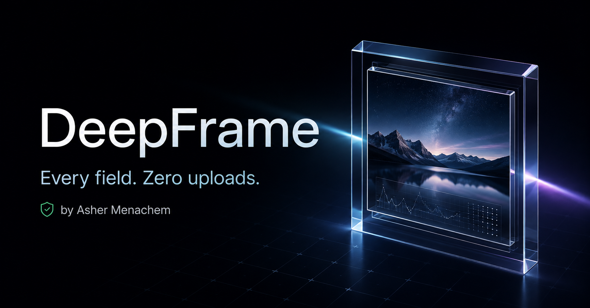
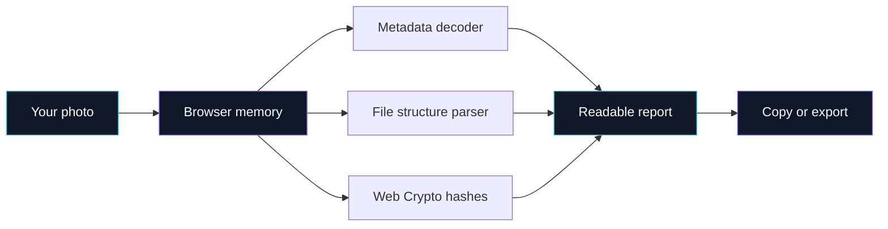

<div align="center">
  <a href="https://deepframesearch.vercel.app">
    
  </a>

  <br />
  <br />

  <a href="https://deepframesearch.vercel.app">
    
  </a>
  
  
  <a href="./LICENSE"></a>

  <h3>See what your photo knows.</h3>

  <p>
    DeepFrame turns the metadata hidden inside an image into a clear, searchable report—camera,
    lens, location, capture settings, editing history, file structure, cryptographic hashes,
    raw tags, and more. Everything runs inside your browser.
  </p>

  <p>
    <a href="https://deepframesearch.vercel.app"><strong>Launch DeepFrame</strong></a>
    ·
    <a href="#what-deepframe-reveals"><strong>Explore features</strong></a>
    ·
    <a href="#run-it-locally"><strong>Run locally</strong></a>
  </p>
</div>

---

## What DeepFrame reveals

| Signal | What you get |
| --- | --- |
| **Camera & lens** | Device maker and model, lens model, focal length, aperture, shutter speed, ISO, flash, and exposure data when embedded |
| **Location** | Exact GPS coordinates and altitude when present, with location excluded from shared reports by default |
| **Time & authorship** | Capture time, modification time, artist, copyright, captions, keywords, and editorial fields |
| **Editing history** | Named software, XMP workflow data, Photoshop records, and other available processing traces |
| **File identity** | True format from magic bytes, MIME type, dimensions, megapixels, aspect ratio, size, and timestamps |
| **Integrity** | SHA-1, SHA-256, SHA-384, and SHA-512 fingerprints calculated locally with Web Crypto |
| **Internals** | JPEG segments, PNG chunks, RIFF blocks, ISO boxes, ICC profiles, maker notes, binary values, and raw decoded metadata |

> **Important:** DeepFrame reports what is actually encoded in the file. It cannot recreate metadata that was removed by a social network, editor, screenshot, or export process.

## Designed for humans

Metadata tools often dump hundreds of cryptic tags and leave the interpretation to you. DeepFrame starts with the answer:

- A plain-English summary of the camera, time, location, and editing history
- Organized groups for EXIF, XMP, IPTC, ICC, maker notes, and file properties
- Searchable fields with readable values and preserved raw data
- One-click copy, native sharing, text export, and complete JSON export
- GPS hidden from shared reports by default
- Responsive, animated interface with reduced-motion support

## Privacy by architecture

Your photo never needs to leave your device.



- No photo upload endpoint
- No account required
- No cloud copy of your image
- No server-side photo processing
- Analysis disappears when the browser session ends

## Responsible use

DeepFrame can surface exact locations and other sensitive details. It is built for legitimate inspection—not stalking, doxxing, covert tracking, harassment, or unauthorized surveillance.

The inspection workspace requires explicit acceptance of the [DeepFrame Terms of Service](https://deepframesearch.vercel.app/terms). Declining keeps the tool locked. Read the repository copy in [TERMS.md](./TERMS.md).

## Supported image families

DeepFrame recognizes and inspects metadata across common modern image containers:

`JPEG` · `PNG` · `HEIC / HEIF` · `WebP` · `TIFF` · `AVIF` · `GIF` · `BMP`

Browser support for previewing a format can vary, but DeepFrame can still inspect many embedded fields and container details directly from the file bytes.

## Run it locally

### Requirements

- Node.js 22
- npm

### Start developing

```bash
git clone https://github.com/ashermenachem/DeepFrame.git
cd DeepFrame
npm install
npm run dev
```

Open [http://localhost:3000](http://localhost:3000).

### Quality checks

```bash
npm run lint
npm run build
```

## Built with

<div align="center">

| Interface | Metadata & files | Tooling & delivery |
| --- | --- | --- |
| Next.js 16 | ExifReader | TypeScript 5.9 |
| React 19 | Web Crypto API | Tailwind CSS 4 |
| Motion | Browser File APIs | oxlint + oxfmt |
| Lucide icons | Custom container parsing | GitHub → Vercel |

</div>

## Project map

```text
app/
├── layout.tsx                 # Metadata, fonts, and global shell
├── page.tsx                   # DeepFrame entry point
└── globals.css                # Visual system and motion
components/
├── photo-data-finder.tsx      # Main product experience
├── deepframe-visual.tsx       # Interactive hero visual
├── intro-sequence.tsx         # Opening animation
└── analysis-loader.tsx        # Analysis state
lib/
├── photo-inspector.ts         # Metadata, hashes, types, and structure
└── share-report.ts            # Human-readable sharing output
public/
├── og-v2.png                  # Social and repository artwork
└── favicon.svg                # DeepFrame mark
```

## Deployment

`main` is the production branch. Every push flows through the connected Vercel Git integration:

```text
Code change → GitHub commit → Vercel build → deepframesearch.vercel.app
```

Other pushed branches receive isolated preview deployments.

## Contributing

Thoughtful bug reports and ideas are welcome. Read [CONTRIBUTING.md](./CONTRIBUTING.md) before opening an issue or pull request. For security concerns, follow [SECURITY.md](./SECURITY.md) instead of posting publicly. Use of the source is subject to the license below.

## License

DeepFrame is **source-available**, not OSI-approved open source. You may view and study the code, but you must receive prior written permission from Asher Menachem before copying, modifying, distributing, hosting, deploying, incorporating, or otherwise using it.

When permission is granted, products using DeepFrame code must give clear, reasonably prominent credit to **DeepFrame by Asher Menachem** with a link to this repository. Credit hidden only in source files, obscure documentation, legal boilerplate, or unusually small footer text is not sufficient.

Read the complete [DeepFrame Source-Available License 1.0](./LICENSE).

## Creator

Built by **Asher Menachem**.

<p>
  <a href="https://www.instagram.com/ashermenachem"></a>
  <a href="https://www.tiktok.com/@ashermenachem"></a>
  <a href="https://github.com/ashermenachem"></a>
  <a href="https://x.com/ashermenachem"></a>
  <a href="https://www.snapchat.com/@asher.menachem"></a>
</p>

---

<div align="center">
  <strong>Every field. Zero uploads.</strong>
  <br />
  <sub>If DeepFrame helps you understand a file, consider starring the repository.</sub>
</div>
